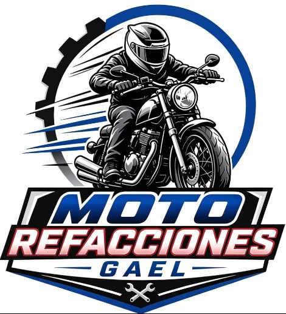

# Moto Refacciones Gael

  

  <strong>Todo lo que tu moto necesita, en un solo lugar.</strong> 
  Refacciones, aceites, baterías y accesorios para motocicletas — calidad, variedad y confianza.

  <em>Documento de referencia de negocio para el desarrollo de pagina recuerda pasarle a claude que se quiere lograr estilo premium / enterprise.</em>

---

## Tabla de contenido

- [Sobre el negocio](#sobre-el-negocio)
- [Propuesta de valor](#propuesta-de-valor)
- [Identidad de marca](#identidad-de-marca)
- [Catálogo de productos y servicios](#catálogo-de-productos-y-servicios)
- [Productos destacados](#productos-destacados)
- [Marcas con las que trabaja](#marcas-con-las-que-trabaja)
- [Público objetivo](#público-objetivo)
- [Logística y cobertura](#logística-y-cobertura)
- [Contacto y redes sociales](#contacto-y-redes-sociales)
- [Objetivo de la landing page](#objetivo-de-la-landing-page)
- [Estructura sugerida de la landing page](#estructura-sugerida-de-la-landing-page)
- [Activos disponibles](#activos-disponibles)
- [Notas para el desarrollador](#notas-para-el-desarrollador)

---

## Sobre el negocio

**Moto Refacciones Gael** es un negocio dedicado a la venta de **refacciones, aceites, lubricantes, baterías y accesorios para motocicletas**. Su promesa central, repetida en todo su material promocional, es ser el lugar donde el cliente encuentra **todo lo que su moto necesita en un solo lugar**, con atención personalizada y entregas rápidas.

El eslogan principal de la marca es:

> **"¡Tu moto lo vale!"**

Acompañado de la frase guía:

> **"Todo lo que tu moto necesita en un solo lugar."**

Otras frases y taglines usados de forma consistente en su comunicación:

- "Tu moto en las mejores manos"
- "Tu moto, nuestra pasión"
- "Dale a tu moto las piezas que merece"
- "¡Todo para que sigas en movimiento!"
- "Enciende tu pasión, nosotros la cuidamos"
- "Confía en expertos, confía en Refacciones Gael"
- "Servicio y calidad garantizados"

## Propuesta de valor

La marca sostiene su comunicación sobre tres pilares, presentes en absolutamente todo su material gráfico:

| Pilar | Significado para el negocio |
|---|---|
| **Calidad** | Productos garantizados, marcas confiables, 100% originales |
| **Variedad** | Refacciones para todas las marcas de motocicleta |
| **Confianza** | Servicio, asesoría especializada y respaldo post-venta |

Beneficios adicionales que la marca destaca de forma recurrente:

- Refacciones originales y genéricas
- Disponibilidad inmediata de producto
- Precios justos, todos los días
- Atención personalizada
- Asesoría especializada para elegir la pieza correcta
- Envíos rápidos y seguros
- Garantía en productos (ej. 6 meses en baterías)

## Identidad de marca

### Nombre y logotipo

- **Nombre comercial:** Moto Refacciones Gael
- **Isotipo principal:** motociclista estilizado (casco integral, chamarra, silueta en escala de grises/negro) en movimiento, enmarcado por un engrane parcial y un círculo azul, sugiriendo velocidad y mecánica.
- **Logotipo/wordmark:** "MOTO" en azul con efecto metálico/cromado y "REFACCIONES" en rojo con degradado, sobre una placa tipo escudo/banderín con "GAEL" en azul y un ícono de llaves cruzadas (herramienta) en la punta inferior.

### Paleta de color (aproximada, validar contra el archivo de logo)

| Color | Uso | Aproximación HEX |
|---|---|---|
| Azul rey | Wordmark "MOTO", círculo del isotipo, fondos y acentos primarios | `#0B4F9E` |
| Azul marino / negro | Fondos oscuros, tipografía secundaria, secciones "premium" | `#0A0E14` |
| Rojo | Wordmark "REFACCIONES", banners de urgencia/oferta | `#C41E2A` |
| Blanco | Fondos claros, contraste de texto | `#FFFFFF` |
| Gris acero | Iconografía secundaria, líneas divisorias | `#4A4A4A` |
| Amarillo | Usado puntualmente en el empaque de la batería (WINMEX) como acento de producto, no como color de marca | `#F5C518` |

> Nota: estos códigos son una estimación visual a partir de los materiales en `imagenes/`. Antes de fijar el sistema de diseño, se recomienda extraer los HEX exactos del archivo `logo.jpg` con un selector de color.

### Tono de comunicación

Directo, orientado a resultados, con lenguaje de "pasión por las motos" y cercanía (tuteo). Uso frecuente de exclamaciones y llamados a la acción cortos ("¡Llámanos!", "¡Contáctanos!"). El estilo visual combina fondos oscuros tipo taller/garage (para dar sensación premium y técnica) con paneles blancos limpios (para catálogo y datos de contacto).

## Catálogo de productos y servicios

### Categorías de refacciones y partes

- Llantas
- Balatas
- Filtros de aceite
- Bujías
- Líquido de frenos
- Grasa para baleros
- Cables de acelerador
- Clutch
- Aceites y lubricantes 4 tiempos
- Baterías para moto
- Accesorios y equipo para motociclista (ej. cascos)

### Servicios

- Venta de refacciones originales y genéricas
- Venta de aceites y lubricantes
- Venta de accesorios y equipo para motos
- Servicio y asesoría especializada
- Cotizaciones vía WhatsApp/llamada
- Envíos a toda la República mexicana

## Productos destacados

La marca maneja al menos tres productos con línea gráfica propia (ideales para tarjetas de producto destacado en la landing page):

### Aceite para motocicleta — AKRON 4 Tiempos

| Especificación | Detalle |
|---|---|
| Tipo | Aceite mineral para motor 4 tiempos |
| Norma | API SL, JASO MA2 |
| Viscosidad | SAE 20W-50 |
| Contenido | 1 US Qt / 946 mL |
| Beneficios clave | Protección superior, máximo rendimiento, lubricación avanzada, ideal para motos 4 tiempos, mayor durabilidad, arranques más suaves, control térmico eficiente |

### Lubricante para cadena — AXPRO

| Especificación | Detalle |
|---|---|
| Tipo | Lubricante en aerosol para cadena de motocicleta |
| Contenido | 400 mL |
| Beneficios clave | Lubricación profunda, protección antidesgaste, reduce fricción y ruido, resistente al agua y polvo, previene oxidación y desgaste |

### Batería para moto — WINMEX (tecnología GEL)

| Especificación | Detalle |
|---|---|
| Modelo | YTX5-BS |
| Tecnología | GEL, libre de mantenimiento, sellada |
| Voltaje | 12V |
| Capacidad | 4Ah (10HR) |
| Garantía | 6 meses |
| Beneficios clave | Mayor durabilidad, a prueba de derrames, resistente al calor, arranque confiable, amigable con el medio ambiente |

## Marcas con las que trabaja

- **Italika**
- **Vento Motorcycles**
- **Winmex** (baterías)
- **Akron** (aceites)
- **AxPro** (lubricantes)
- Refacciones compatibles con **todas las marcas** de motocicleta (mensaje explícito: "refacciones para todas las marcas")

## Público objetivo

- Motociclistas propietarios de motos de trabajo/uso urbano (Italika, Vento) y de motos deportivas/de mayor cilindrada.
- Personas que buscan mantenimiento preventivo (aceite, filtros, balatas, batería) y no solo reparación por falla.
- Clientes que valoran la atención directa por WhatsApp y la asesoría antes de comprar la pieza correcta.
- Compradores en toda la República mexicana (no limitado a una ciudad), gracias al servicio de envíos.

## Logística y cobertura

- **Envíos a toda la República**, descritos como rápidos y seguros.
- Existe **sucursal física** ("Visítanos en nuestra sucursal"), aunque los materiales disponibles no especifican dirección exacta — se debe solicitar al cliente para incluirla en el mapa/sección de contacto del sitio.
- Entregas rápidas con atención personalizada como diferenciador de servicio.

## Contacto y redes sociales

| Canal | Dato |
|---|---|
| WhatsApp / Teléfono | **56 4113 1906** |
| Facebook | facebook.com/MotoRefaccionesGael |
| Instagram | @refaccionesgael |

## Objetivo de la landing page

Construir una landing page de **estilo premium / enterprise** para Moto Refacciones Gael que:

1. Comunique de inmediato la promesa de marca ("Todo lo que tu moto necesita en un solo lugar") y el eslogan ("¡Tu moto lo vale!").
2. Transmita confianza y calidad mediante un diseño oscuro/técnico tipo taller combinado con paneles limpios para catálogo, similar al lenguaje visual ya usado en sus flyers.
3. Facilite el contacto inmediato por WhatsApp (CTA principal) como canal de conversión.
4. Muestre el catálogo de productos y categorías de refacciones de forma clara y escaneable.
5. Refuerce los tres pilares de marca (Calidad, Variedad, Confianza) como sección de diferenciadores.
6. Incluya enlaces directos a redes sociales (Facebook, Instagram) y datos de contacto siempre visibles (header/footer).

## Estructura sugerida de la landing page

1. **Hero** — Logotipo, eslogan "¡Tu moto lo vale!", tagline principal, CTA de WhatsApp, imagen/ilustración del motociclista.
2. **Pilares de marca** — Calidad · Variedad · Confianza, con iconografía.
3. **Sobre nosotros** — Historia corta / propuesta de valor ("Tu moto, nuestra pasión").
4. **Catálogo / Categorías** — Grid de categorías (llantas, balatas, filtros, bujías, líquido de frenos, grasa para baleros, cables de acelerador, clutch, aceites, baterías, accesorios).
5. **Productos destacados** — Tarjetas para Aceite Akron, Lubricante AxPro y Batería Winmex, con specs y CTA de cotización.
6. **Marcas compatibles** — Logos/mención de Italika, Vento y "todas las marcas".
7. **Por qué elegirnos** — Disponibilidad inmediata, precios justos, asesoría especializada, garantía, envíos a toda la República.
8. **Cobertura y envíos** — Mensaje de envíos nacionales + ubicación de sucursal (pendiente de dirección exacta).
9. **Contacto** — WhatsApp destacado, teléfono, redes sociales, formulario de cotización opcional.
10. **Footer** — Logotipo, redes sociales, teléfono, pilares de marca, aviso legal/derechos.

## Activos disponibles

Carpeta [`imagenes/`](imagenes/) — material gráfico fuente para extraer logotipo, iconografía y referencias de layout:

| Archivo | Contenido |
|---|---|
| `logo.jpg` | Isotipo + wordmark oficial (fondo blanco, para usar como logo principal) |
| `12.jpeg` | Poster completo de marca: eslogan, logo, pilares y contacto |
| `WhatsApp Image ... 3.16.43 PM.jpeg` | Tarjeta de presentación / ficha de contacto |
| `WhatsApp Image ... 3.16.44 PM.jpeg` | Flyer "Refacciones para moto" (variante con logo ilustrado alterno) |
| `WhatsApp Image ... 3.16.44 PM (1).jpeg` | Tarjeta de contacto con redes sociales completas |
| `WhatsApp Image ... 3.16.44 PM (2).jpeg` | Flyer "Tu moto, nuestra pasión" — oferta general de servicios |
| `WhatsApp Image ... 3.16.44 PM (3).jpeg` | Ficha de producto: Aceite Akron 4 Tiempos |
| `WhatsApp Image ... 3.16.44 PM (4).jpeg` | Ficha de producto: Lubricante de cadena AxPro |
| `WhatsApp Image ... 3.16.44 PM (5).jpeg` | Ficha de producto: Batería Winmex GEL |
| `WhatsApp Image ... 3.16.45 PM (1).jpeg` | Flyer de catálogo de piezas (llantas, balatas, filtros, etc.) + marcas Italika/Vento |
| `WhatsApp Image ... 3.16.45 PM.jpeg` | Flyer resumen "Productos de calidad" (batería, lubricante, aceite) |

## Notas
- Importante quitar el fondo al logo
- No se cuenta con dirección física exacta de la sucursal ni con horario de atención — solicitar al cliente si se desea incluir mapa/horario en la sección de contacto.
- No se cuenta con fotografías propias del local, del inventario real o del equipo — actualmente todo el material es gráfico/publicitario (flyers), por lo que probablemente se necesiten fotografías reales o se deba trabajar con las ilustraciones vectoriales existentes.
- El teléfono/WhatsApp `5641131906` es el único canal de contacto directo confirmado en todos los materiales; debe ser el CTA primario del sitio.
